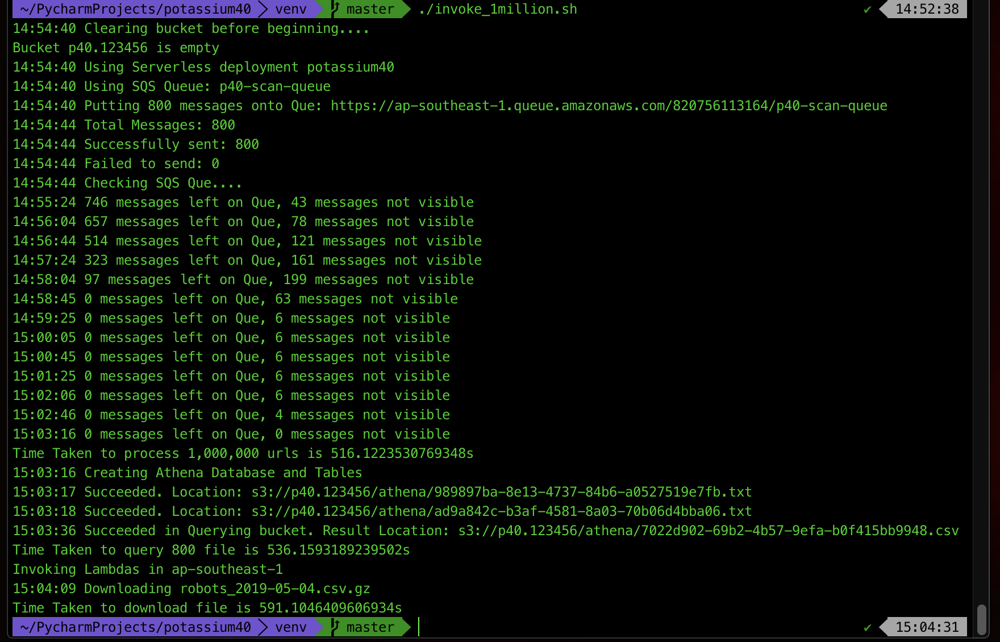
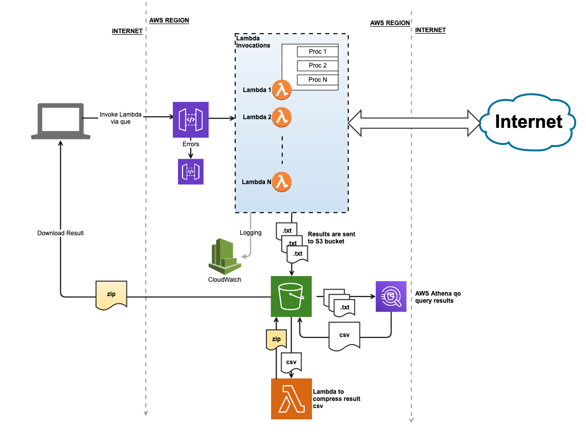

# What is Potassium40

Pottasium40 is http scanner, that's built for speed..

It uses AWS Lambda functions to invoke up to 1000 parallel functions that can scan 1 million domains in 5 minutes (or less!)

This project **proof-of-concept** that will grab and download all `robots.txt` files from the cisco umbrella top 1 million. The code can be changed to grab any other file, or check for http-headers, presence of folders etc.

This is **not** a port-scanner. 

It's a http scanner, that can scan websites for specific content, create a http connection to a specific url, including handling redirects and negotiating TLS connections. If you want to scan ports, I suggest you use masscan.

**NOTE:** Potassium40 runs on Amazon Web Services (AWS), and while for most use-cases it'll fit into the free-tier, you will be charged if you go overboard. A scan of 1 million websites can be run ~10 times before you have to start paying, roughly $0.60 per 1 million websites.

# Running

## To Install:

    $ git clone https://github.com/keithrozario/potassium40.git
    $ cd potassium40
    $ ./install.sh

For information of what is deployed during the install, refer to components below. By default all installations are done in `ap-southeast-1` but you can change this by modifying the `lambda/serverless.yml` file. The file format is identical to format of the serverless framework, but the framework is not required for deployment. 

## To run :

    $ ./get_robots.py

The default setting is 100 parallel lambdas scanning 125,000 sites. To scann all 1 million use the following:

    $ ./get_robots.py -n 800

the `n` command line argument is the number of lambda invocations. Each lambda will scan 1250 websites, hence 800 would scan all 1 million.

## To uninstall:

    $ ./uninstall.sh
 
Uninstall will delete all lambda functions, lambda layers, Cloudwatch logGroups for the lambdas, and the s3 bucket. Your AWS account will effectively be wiped clean of everything deployed during the install.
    
**Notes**: 
* The installation script will install a python3 virtualenv in the `venv/` directory. You'll need to activate this directory in order to run the scan. When you run the installation script, the environment will be activated for you.
* It is recommended that you already have installed AWS-CLI, but not necessary. As long as the `~/.aws/credentials` file is populated the script will work.
 

# Components

In order to run a proper scan, pottasium40 deploys the following components into your AWS account

* 2 Lambda functions
    * pottasium40_get_robots : Performs the scan and outputs data to an S3 bucket
    * pottasium40_compress_bucket : Compresses all files in the S3 bucket into a single file (gzip)
* 1 S3 Bucket with a randomly generated named, prefixed with pottasium40-
* An IAM Role and IAM policy that allows the lambdas to access the bucket a CloudWatch LogGroups

These components are all deployed during installation. All details of the installation are stored in the `lambda/deploy/status.json` file.

All components aboved are deleted during uninstallation. All objects in the bucket, and even CloudWatch logGroups are deleted. 

# Warning

This tool is still in beta mode. Use at your peril. But look at these results:

# Architecture

I intend to write in more detail about the architecture, but for now here's a quick n' dirty diagram

# Results

If you just want the robots.txt files, [here's the latest scan I did](https://www.dropbox.com/s/u06emca53n38dm9/robots.json.gz?dl=0)

# To do

I'll have to clean up this repo. It's too messy :)

# Contact

keith@keithrozario.com